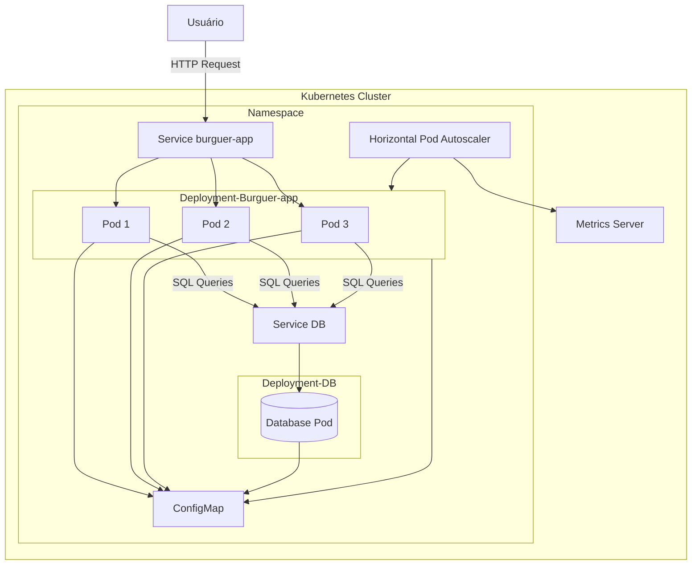

# Fiap 51 Burguer

Sistema de pedidos de lanche. Segundo tech challenge do curso de Pós Tech - turma 6SOAT de Software Architecture para aplicar conceitos de clean code e clean architecture.

## 👨‍🔧👩‍🔧 Integrantes
Carlos Jafet - RM 354076 - cjafet07@gmail.com

Guilherme Macedo Moreira - RM 353750 - guilherme.macedomoreira@gmail.com

Isabella Bellinazzi da Silva - RM 354143 - isabellinazzi@hotmail.com

Juliano Silva Nunes - RM 354144 - silva.juliano8130@gmail.com

Thiago Augusto Nery - RM 355063 - doomerbr@gmail.com

## 🔨 Funcionalidades do projeto

    - CRUD Cliente.
                      
    - Identificação do Cliente via CPF.
 
    - CRUD produtos.
                      
    - Buscar produtos por categoria.
                       
    - Fake checkout, apenas enviar os produtos escolhidos para a fila. O checkout é a finalização do pedido.

    - CRUD pedidos.
                     
    - Listar os pedidos.

    - Checkout do pedido que deve receber os produtos solicitados e retornar a identificação do pedido.

    - Consultar status do pagamento do pedido.

    - Webhook recebendo confirmação de pagamento.

## ✔️ Técnicas e tecnologias utilizadas

**Faça uma lista de tecnologias e técnicas utilizadas (a justificativa e descrição são opcionais)**:

- `Aplicação`: Java 22
- `Banco de dados`: My SQL
- `Arquitetura`: Clean Architecture
- `Containerização`: Docker
- `Orquestação`: Kubernets
- `Design de software`: DDD

## 📐 Diagrama de arquitetura

## 🛠️ Abrir e rodar o projeto

**Instruções necessárias para abrir e executar o projeto**

Deverá ter instalado:

    - JDK 22
    - Docker(Certifique-se de que as opções de kubernets estejam habilitadas no docker desktop)

Após a instalação executar os comandos ordenados abaixo na pasta raiz da aplicação:

1 . **Aplicar ConfigMap:**

    - kubectl apply -f .\k8s\configmap-burguer-app.yaml

2 . **Aplicar Métricas:**

    - kubectl apply -f .\k8s\metrics.yaml

3 . **Aplicar Deployment do Banco de Dados:**

     - kubectl apply -f .\k8s\deployment-db.yaml

4 . **Aplicar Service do Banco de Dados:**

     - kubectl apply -f .\k8s\service-db.yaml

5 . **Aplicar Deployment da Aplicação:**

     - kubectl apply -f .\k8s\deployment-burguer-app.yaml

6 . **Aplicar Service da Aplicação:**

     - kubectl apply -f .\k8s\service-burguer-app.yaml

7 . **Aplicar Horizontal Pod Autoscaler:**

     - kubectl apply -f .\k8s\hpa-burguer-app.yaml

     

## 📁 Acesso ao projeto
Você pode acessar os arquivos do projeto clicando [aqui](https://github.com/GuiMM/fiap-51burguer),

E aos diagramas de DDD clicando [aqui](https://miro.com/app/board/uXjVKTKDZGE=/).

## 🔧 Após a execução do projeto

Você pode acessar a lista de endpoints ja configurada para importar no postman clicando [aqui](https://github.com/GuiMM/fiap-51burguer/blob/master/FIAP%20-%20Burger%20API.postman_collection.json),

Ou acesse os endpoints pelo Swagger no link [link](http://localhost:8080/swagger-ui/index.html#).

## 📚 Mais informações do curso
**Pós Tech - Turma 6SOAT**

**Tech challenge 2: Refatoração do projeto seguindo os padrões de clean code e clean architecture e orquestração de containers de forma escalável**

## 📄 Licença
Não se aplica.
